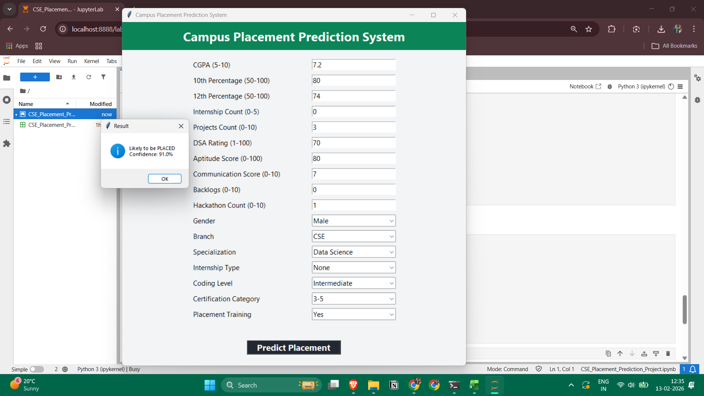

# 🎓 Campus Placement Prediction System

A Machine Learning based desktop application that predicts whether a student is likely to be placed based on academic performance, skills, internships, and certifications.

---

## 🚀 Project Overview

This project uses a **Random Forest Classifier** to predict campus placement outcomes.

The system takes academic, skill-based, and profile-based inputs from the user and provides:

- ✅ Placement Prediction (Placed / Not Placed)
- 📊 Confidence Score (Probability)
- 🖥️ Interactive GUI Application

---

## 🧠 Features Used for Prediction

### 🔢 Numerical Features
- CGPA
- 10th Percentage
- 12th Percentage
- Internship Count
- Projects Count
- DSA Rating
- Aptitude Score
- Communication Score
- Backlogs
- Hackathon Participation

### 🟢 Categorical Features
- Gender
- Branch
- Specialization
- Internship Type
- Coding Level
- Certification Category
- Placement Training

---

## 🛠 Tech Stack

- **Python**
- **Pandas & NumPy**
- **Scikit-learn**
  - Label Encoding
  - Train-Test Split
  - RandomForestClassifier
- **Tkinter (GUI Deployment)**

---

## 📊 Machine Learning Pipeline

1. Data Cleaning & Preprocessing  
2. Categorical Encoding using LabelEncoder  
3. Train-Test Split (80/20)  
4. Model Training (Random Forest)  
5. Accuracy Evaluation  
6. GUI Deployment for Real-Time Prediction  

---

## 🖥️ Application Screenshot

### 🔹 Prediction Output Example

---

## 📂 Project Structure

📁 Campus-Placement-Prediction
├── CSE_Placement_Prediction.csv
├── CSE_Placement_Prediction_Project.ipynb
├── output.png
└── README.md

---

## 💡 Key Highlights

✔ Real-world ML deployment  
✔ Handles categorical unseen label issues  
✔ Clean GUI Interface  
✔ Confidence-based prediction  
✔ Production-level preprocessing  

---

## 📈 Future Improvements

- Add Feature Importance Visualization
- Deploy as Web App (Flask / Streamlit)
- Add Model Comparison (Logistic, XGBoost)
- Deploy on Cloud

---

## 👨‍💻 Author

**Sanskar Gupta**  
B.Tech CSE (Data Science)

---

## ⭐ If you like this project, give it a star!

